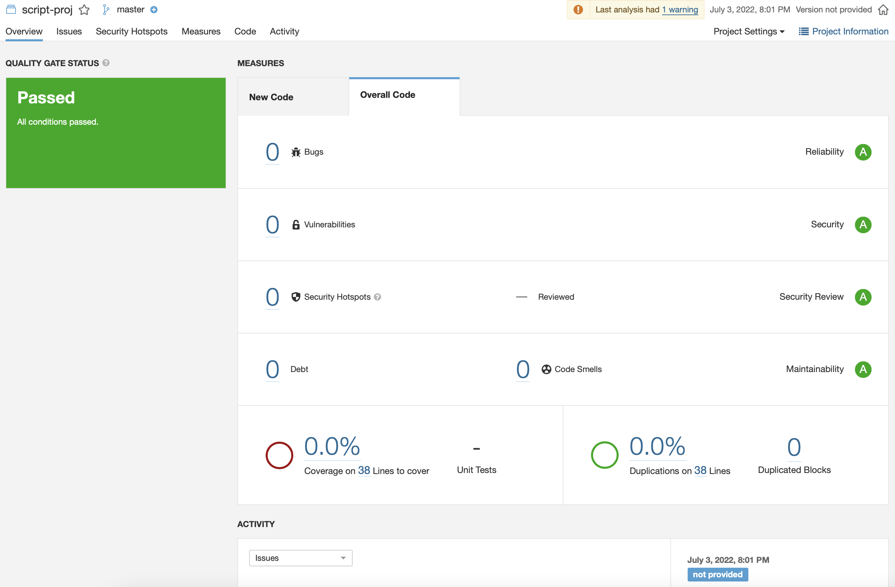

# Solution

## Approach

I have decided to initally run a code analysis tool which will give an intall indection fo code quality and or will give insight to problems with the code regarding which SonarQube can detect.


### Static Code Analysis
First of all to tackle the requierment of suggesting edits to improve the script I initally used sonnarqube to run inital static code analysis on the given code.



___"Sadly"___ there where no issues with the code that came up from the code scan.

### Self Analysis

Our goal is that the script will run and fetch the images as soon as they are avilable while keeping a chronological order.

1. The main program loop will always run on the entire list of embryos even if we have iterated through that embryo. 
```python
   for embryo_id in inc.get_all_embryo_ids(): 
```
* move the `elif` statement which checks if embryo has reached completed status to the start of the loop block so to imideatly ignore all of the bulk of the embryos which we have finished iterating over and that will not give us any more information.
```python
elif embryo_stats[embryo_id]['completed']: 
            # embryo is already completed - pass 
            pass 
```


2. have the `while image is not None` code block exported to a function to solve code duplication
```python
while image is not None: 
    embryo_stats[embryo_id]['last_request_time'] = datetime.now() 
    embryo_stats[embryo_id]['last_index'] = request_index 
    embryo_stats[embryo_id]['completed'] = completed 
    vid_builder.append_images(embryo_id, [image]) 
    request_index+=1 
    image,completed = inc.get_image(embryo_id, request_index)
```